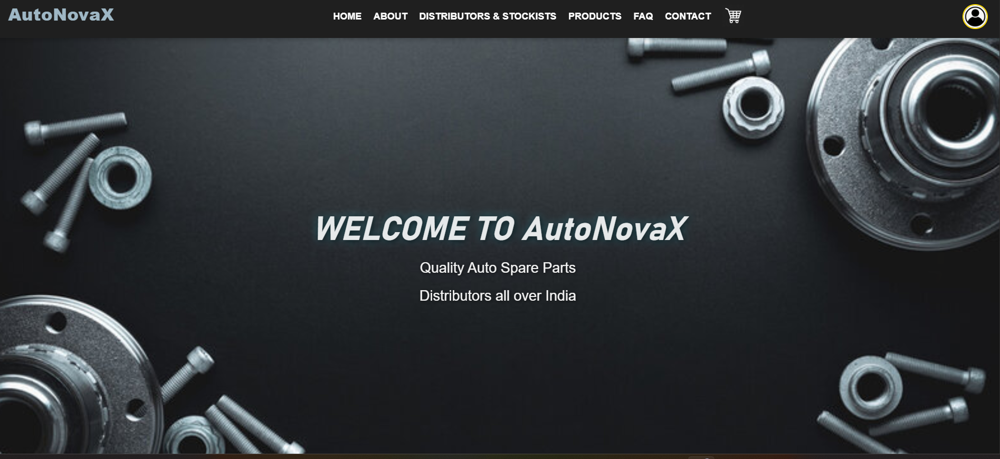
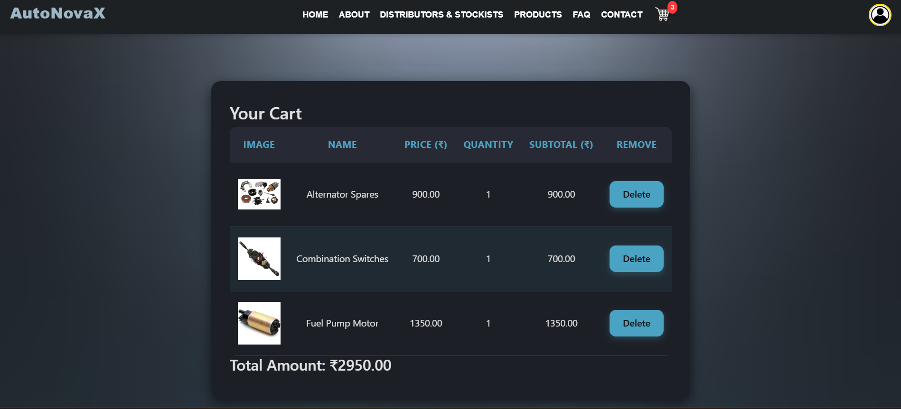
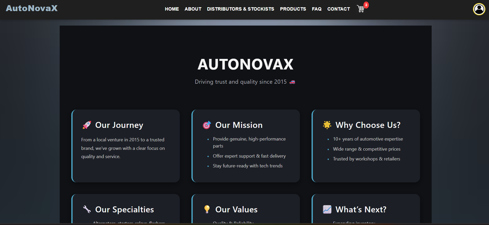

# AutoNovaX – Automobile E-Commerce Website

## About the Project

**AutoNovaX** is a modern **frontend-only automobile e-commerce website** for browsing automobile spare parts and accessories.

The project is built using **React** and demonstrates how an online automobile store interface works without a backend. Users can browse products, view product details, and interact with a **simulated shopping cart implemented on the client side**.

This project focuses on **frontend development, UI design, and component-based architecture**.

**Note:** This project is for **demonstration purposes only**. It does not include a backend, database, or payment system.

---

## Features

* Product listings with images and descriptions
* Product details page
* Simulated shopping cart (client-side only)
* Pages included:

  * Home
  * About
  * Contact
  * FAQ
  * Distributors
  * Profile
  * Login / Logout
* Responsive design for **desktop, tablet, and mobile**
* Clean UI built using **React components and CSS**

---

## Tech Stack

* React
* JavaScript
* HTML
* CSS
* Node.js / npm

---

## Project Screenshots

### Home Page



### Product Listings



### Shopping Cart



---

## Project Structure

```
AutoNovaX
│
├── public
│
├── src
│   ├── assets        # Images and media files
│   ├── components    # Reusable UI components
│   ├── pages         # Website pages
│   ├── styles        # CSS files
│   ├── App.js
│   ├── index.js
│   └── index.css
│
├── .env
├── .gitignore
├── README.md
├── package.json
├── package-lock.json
├── autonovax1.png
├── autonovax2.png
└── autonovax3.png
```

---

## How to Run the Project

1. Clone the repository

```
git clone https://github.com/at-vaishnavi/AutoNovaX.git
```

2. Navigate to the project folder

```
cd AutoNovaX
```

3. Install dependencies

```
npm install
```

4. Run the development server

```
npm start
```

---

## Future Improvements

* Add backend integration
* Implement user authentication
* Add product database
* Implement payment gateway
* Improve product search and filtering

---

